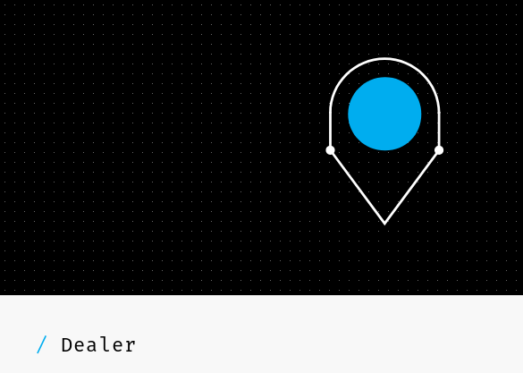

[](https://godoc.org/github.com/MarinX/go-mercedes-dealer)
[](LICENSE)


# Description
Whether you want to show the nearest Mercedes–Benz dealer or partner on map or want to provide reliable dealer information.

Features
* geolocation data for showing dealers and service partners on map
* contact information (address, telephone number, e-mail address, website etc.)
* opening hours
* details on services provided (sales, service, parts, used car sales)


# Precondition
You will need an API-Key to use this library. Signup for api at [developer.mercedes-benz.com](https://developer.mercedes-benz.com)

# Installation
    go get github.com/MarinX/go-mercedes-dealer


# Documentation


<table>
<tr>
    <th>Function</th>
    <th>Description</th>
  </tr>
  <tr>
    <td>GetCountries(page int, pageSize int)</td>
    <td>Get the supported countries for the Dealer API</td>
  </tr>
  <tr>
    <td>GetDealers(filterParams DealerParam)</td>
    <td>Search for Dealers</td>
  </tr>
  <tr>
    <td>GetDealer(dealerId string)</td>
    <td>Search for specific dealer</td>
  </tr>
</table>

### Example
```go
// Find dealers near city of Zagreb
dealers, err := api.GetDealers(&DealerParam{
		City: "Zagreb",
})
// You can also specify other values like radius, lat, lng etc.
// Look at the godoc reference for more information about DealerParam

// Get single dealer by the code - Emil Frey
singleDealer, err := api.GetDealer("GS0038375")

// The countries that are supported by the Dealer API will be provided by the countries resource
// Get the first page with limit of 5 results
countries, err := api.GetCountries(1, 5)
```

# License
This library is under the MIT License

# Author
Marin Basic 

